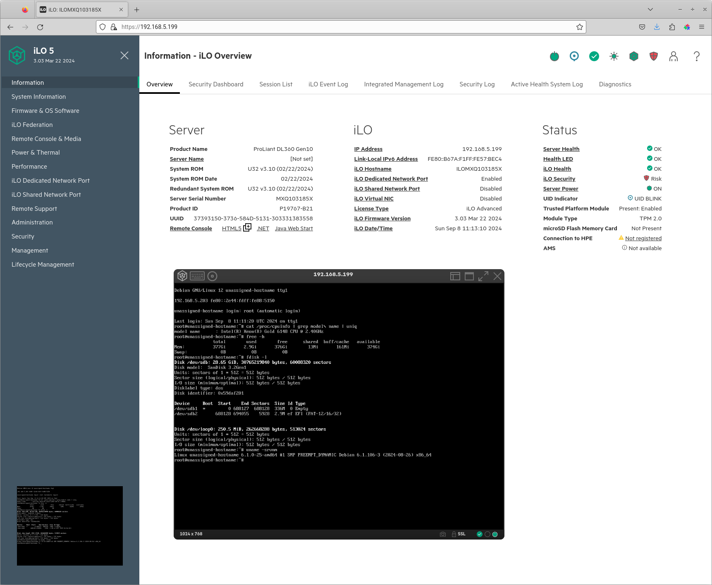
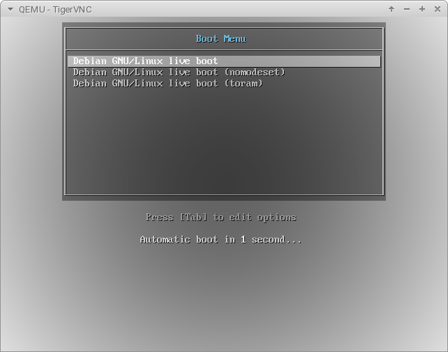
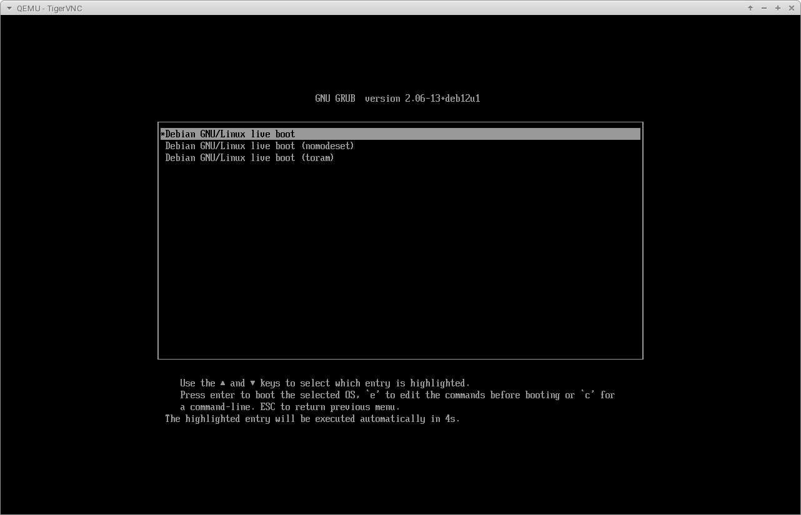
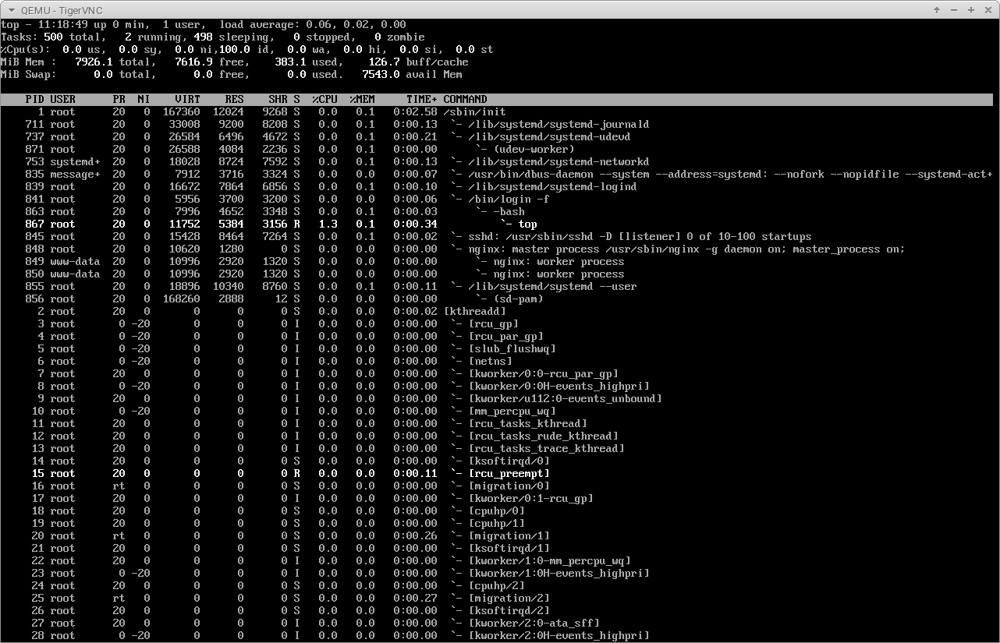

# Lessbian GNU/Linux

Lessbian GNU/Linux - это Debian GNU/Linux, только чуть более "less" (менее).

Дистрибутив собирается вручную, без использования live build, т.к. live build имеет ряд багов, которые мне надоело исправлять, что в итоге оказалось проще собрать самому с нуля.

Дистрибутив создавался для моих личных нужд, необходимых в работе системным администратором и работой с серверами, и будет дорабатываться время от времени без какого-либо Roadmap.
 
```
# ./build-iso-hybrid.sh
...
Output
/root/lessbian/build.tUT/live_boot/output.iso

real    3m14.649s
user    6m37.707s
sys     0m49.422s
```

Для сборки рекомендуется использовать локальное зеркало Debian, в таком случае можно минимизировать время сборки и у меня оно составляет около 3х минут.

Из особенностей дистрибутива:

- Добавлено отображение IP-адресов в консоли, все остальные Message-Of-The-Day отключены.

- Устанавливается минимальный набор софта (minbase), но с некоторыми необходимыми системными утилитами (fdisk, procps)

- Включена вся firmware.

- Предустановлены wireguard, ssh и nginx с уже включённым ssl (self-signed).

Скриншоты:








